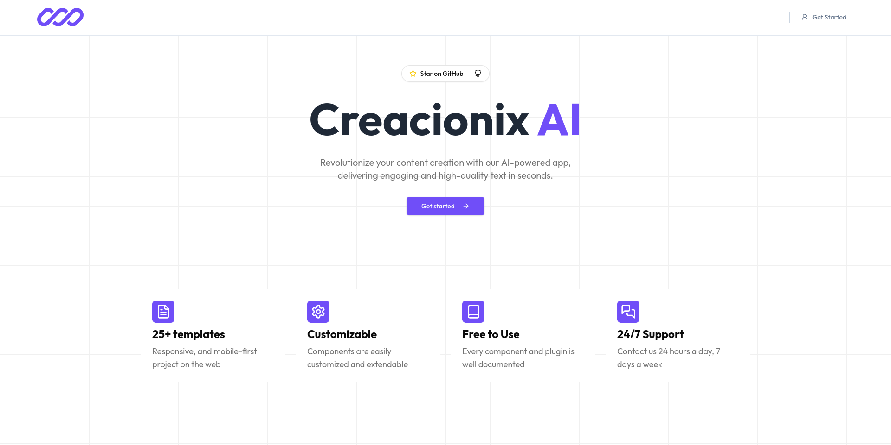

# Creacionix AI

Creacionix AI is a web application that uses generative AI to generate content based on user input. It is built using Next.js, TypeScript, and Tailwind CSS.




## Features

- User-friendly interface for inputting data and selecting templates
- Generative AI powered content generation
- Integration with Google's Generative AI API
- Database integration with Drizzle ORM
- User authentication with Clerk

## Getting Started

To get started, follow these steps:

1. Clone the repository:

```bash
git clone https://github.com/isaias-alt/creacionix-ai.git
```

2. Install dependencies:

```bash
pnpm install
```

3. Create a `.env.local` file in the root directory following the [`.env.local.example`](/.env.local.example) file and add your Google Generative AI API key:

4. Run the development server:

```bash
pnpm dev
```

5. Open [http://localhost:3000](http://localhost:3000) in your browser.

## Contributing

Contributions are welcome! If you find a bug or have a suggestion, please open an issue or submit a pull request.

## License

This project is licensed under the [MIT License](LICENSE)